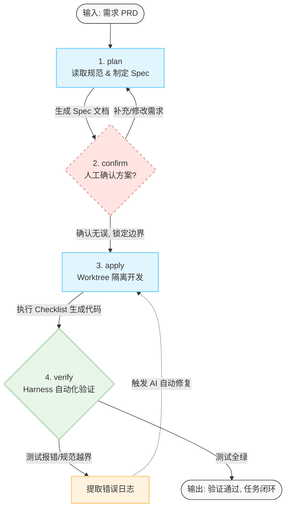

> **让 AI 开发从"撞运气"的对话，变成"有凭据"的工程**

## 写在前面

在上一篇《VibeCoding 工作流》中，我们探讨了如何通过自然语言与 AI 协作进行开发。但随着团队规模扩大、项目复杂度提升，你会发现一个问题：**Vibe Coding 虽然快，但不够稳**。

最常见的问题不是"模型不够强"，而是"工作方式不稳定"：
- AI 的输出随着模型状态波动，结果不可预测
- 历史决策埋在对话中，难以审计和追溯
- 超过 3 个文件的改动，AI 容易"迷路"
- 会话结束即失去记忆，难以接力协作

本文将介绍一套更工业化的方法论——**Harness Engineering**，它的目标是把 AI 从"会聊天的外包"变成"遵循 SOP 的数字员工"。

## 核心理念：什么是 Harness Engineering 与 SDD？

### 什么是 SDD (Spec-Driven Development)？

**Spec-Driven Development（规范驱动开发）** 是这套流程的灵魂。

**传统开发流程：**
```
需求 → 编码 → 调试
```

**SDD 流程：**
```
需求 → 规范/计划 (Spec) → 编码 → 验证
```

在 AI 时代，代码生成是廉价且易变的，真正昂贵的是**正确的逻辑设计和约束控制**。

SDD 要求 AI 在动代码之前，先生成一套可描述、可验证的"作战计划"（即 `plan.md`、`checklist.md`），这套计划就是 AI 执行任务的"宪法"。

### 什么是 Harness？

**Harness** 原意是"马具"或"测试台"。在软件工程中，它是一套**约束 AI 行为的脚手架环境**。

它不只是几个命令，而是一个闭环系统：

**环境隔离**
- 通过 `git worktree` 自动创建独立的执行空间
- 避免 AI 污染主分支
- 支持并行开发多个任务

**上下文注入**
- 自动将项目规则、架构设计、任务历史注入 AI 的上下文窗口
- 确保 AI 的决策基于项目实际情况
- 减少违背团队约定的低级错误

**自动化验证**
- 预设的校验脚本像"装具"一样扣在代码上
- 不通过验证则不允许交付
- 验证结果自动回写到任务文档

### Harness Engineering vs. Vibe Coding

| 维度 | Vibe Coding (凭感觉写) | Harness Engineering (工业化写) |
| :--- | :--- | :--- |
| **确定性** | 随大模型状态波动，结果不可预测 | 基于确认后的 Spec 执行，路径固定 |
| **可追溯性** | 历史埋在对话中，难以审计 | 过程沉淀在仓库 `tasks/` 目录下，永久可溯 |
| **复杂任务** | 超过 3 个文件改动时，AI 容易"迷路" | 任务拆解为原子项，按 Checklist 逐个推进 |
| **协作能力** | 会话结束即失去记忆，难以接力 | 标准化上下文文件，支持多人/多 Agent 协作 |
| **验证方式** | "肉眼观察"或手动运行，容易漏测 | Harness 强制触发自动化验证，结果回写 Spec |

## 为什么需要 Harness Engineering

### 把开发过程结构化

需求进入仓库后，不再是"开个聊天窗口直接开始改代码"，而是固定走标准流程：

```
plan → confirm → apply → verify
```

- **先想清楚，再动代码**：避免 AI 盲目猜测
- **落地成文**：需求理解、实现计划、验证结果都有落地文件

### 核心状态流转图



### 把 AI 的输出约束到项目上下文里

AI 不是凭空发挥，而是必须先读取：
- 仓库工作流规范
- 项目架构设计
- 当前任务文档

这可以明显减少改错模块、违背团队约定等低级错误。

### 让过程可追踪、可沉淀

任务目录里会沉淀完整的文档：
- `prd.md` - 需求文档
- `plan.md` - 实现计划
- `checklist.md` - 执行清单
- `verification.md` - 验证报告

这意味着一次需求开发，留下的**不只是代码，还有完整的技术设计和验证证据**。这些文档成为团队的**任务资产**，可以：
- 帮助新人快速理解历史决策
- 支持代码审查和技术评审
- 作为知识库的一部分持续积累

## 标准流程详解

### 阶段 1：Plan（想清楚）

**目标**：生成 Spec，把需求想清楚

**AI 的工作**：
1. 探索相关代码和模块
2. 判断业务影响范围
3. 拆分任务为可执行的原子项
4. 生成 Spec 文档（`plan.md` 和 `checklist.md`）

**关键边界**：
- AI 先提出澄清问题，你补充信息
- AI 总结理解并询问你是否继续
- 只有你明确同意后，才生成计划产物

**输出产物**：
```
tasks/
  └── task-001-user-export/
      ├── prd.md           # 需求描述
      ├── plan.md          # 实现计划
      └── checklist.md     # 执行清单
```

**plan.md 示例结构**：
```markdown
# 实现计划：用户数据导出功能

## 需求理解
- 支持导出用户列表为 Excel
- 包含用户基本信息和订单统计
- 需要权限控制

## 技术方案
### 1. 后端接口
- 路径：`/api/users/export`
- 使用 ExcelJS 生成文件
- 异步任务处理大数据量

### 2. 前端交互
- 添加导出按钮
- 显示导出进度
- 下载完成提示

## 影响范围
- 新增文件：`services/user-export.js`
- 修改文件：`routes/users.js`, `pages/users/index.vue`

## 验证方案
- 单元测试：导出逻辑
- 集成测试：完整导出流程
- 性能测试：10000 条数据导出时间 < 30s
```

### 阶段 2：Confirm（订契约）

**目标**：明确任务边界

这是一个**人工决策点**，意义在于：
- 一旦确认，AI 后续的所有代码修改都必须基于这个方案
- 防止 AI 在实现过程中"自由发挥"

**确认前请检查**：
- ✅ 模块找得对不对？
- ✅ 改造范围全不全？
- ✅ 验证方案是否可行？
- ✅ 是否遗漏了边界情况？

**确认方式**：
```
# 人工审查 plan.md 和 checklist.md
# 如果有问题，要求 AI 修改计划
# 确认无误后，明确告诉 AI："计划确认，开始实施"
```

### 阶段 3：Apply（做隔离）

**目标**：在隔离环境中实现功能

**Harness 核心操作**：
1. 自动创建 `git worktree` 隔离区
2. 创建独立分支（如 `2605/user-export-feature`）
3. AI 在隔离环境中按 `checklist.md` 逐项执行
4. 持续回写执行状态到上下文

**关键顺序**：
```
用户："计划确认，开始实施"
  ↓
AI：执行 harness:apply 创建 worktree
  ↓
AI：切换到 worktree 目录
  ↓
AI：按 checklist 逐项实现
  ↓
AI：在 worktree 中运行测试
```

**禁止绕过**：
- ❌ 在拿到 worktree 路径前，不应该在主工作目录里改代码
- ❌ 不能跳过 worktree 创建，直接在主分支上开发
- ✅ 后续所有操作都应该在 worktree 中执行

**分支命名规则**：
```
格式：YYMM/<english-branch-slug>
示例：2605/user-export-feature
```

**为什么要隔离**：
- 避免污染主分支
- 支持并行开发多个任务
- 失败时可以快速清理
- 便于代码审查和回滚

### 阶段 4：Verify（拿证据）

**目标**：闭环验证，获取客观证据

这不是"顺手补测"，而是**独立的验证阶段**。

**自动化验证**：
- Harness 调用预设的验证脚本
- 运行单元测试、集成测试
- 执行代码质量检查（lint、type check）
- 运行性能测试（如果需要）

**客观性原则**：
- 不听 AI 的口头保证
- 只看测试报告的真实回写
- 验证结果必须落地到 `verification.md`

**verification.md 示例**：
```markdown
# 验证报告：用户数据导出功能

## 执行时间
2026-05-07 14:30:00

## 测试结果

### 单元测试
✅ 通过 (15/15)
- user-export.test.js: 8 passed
- excel-generator.test.js: 7 passed

### 集成测试
✅ 通过 (5/5)
- 完整导出流程: passed
- 权限控制: passed
- 大数据量导出: passed

### 代码质量
✅ ESLint: 0 errors, 0 warnings
✅ TypeScript: 0 errors

### 性能测试
✅ 10000 条数据导出时间: 23.5s (< 30s)

## 结论
所有验证项通过，功能可以交付。
```

## 实践案例：新增用户导出功能

让我们通过一个完整的案例，看看 Harness Engineering 如何运作。

### 场景描述

**需求**：在用户管理页面添加"导出用户数据"功能，支持导出为 Excel 文件。

### 步骤 1：执行 Plan

**输入**：
```
"需求：在用户管理页面添加导出功能
- 导出格式：Excel
- 包含字段：用户名、邮箱、注册时间、订单数量
- 需要管理员权限
请制定实现计划"
```

**AI 的工作**：
1. 探索现有用户管理模块
2. 分析权限控制机制
3. 研究 Excel 生成方案
4. 生成 `plan.md` 和 `checklist.md`

**输出**：
```
已生成实现计划：
- tasks/task-001-user-export/plan.md
- tasks/task-001-user-export/checklist.md

计划要点：
1. 后端新增 /api/users/export 接口
2. 使用 ExcelJS 库生成文件
3. 前端添加导出按钮和进度提示
4. 集成现有权限中间件

请审查计划，确认后我将开始实施。
```

### 步骤 2：确认计划

**人工审查**：
- ✅ 技术方案合理
- ✅ 权限控制已考虑
- ⚠️ 缺少大数据量处理方案

**反馈**：
```
"计划整体不错，但需要补充：
如果用户数量超过 10000，应该使用异步任务处理，
并提供下载链接，而不是直接返回文件。"
```

**AI 更新计划**：
```
已更新 plan.md：
- 添加异步任务处理逻辑
- 数据量 > 10000 时，创建后台任务
- 任务完成后发送通知，提供下载链接

请确认更新后的方案。
```

**最终确认**：
```
"计划确认，开始实施"
```

### 步骤 3：执行 Apply

**AI 自动执行**：
```
1. 创建 worktree: .worktrees/2605-user-export
2. 创建分支: 2605/user-export-feature
3. 切换到 worktree 目录
4. 按 checklist 逐项实现：
   ✅ 安装 ExcelJS 依赖
   ✅ 创建 services/user-export.js
   ✅ 添加 /api/users/export 路由
   ✅ 实现异步任务逻辑
   ✅ 前端添加导出按钮
   ✅ 添加进度提示组件
5. 提交代码
```

### 步骤 4：执行 Verify

**自动化验证**：
```
运行验证脚本...

单元测试: ✅ 18/18 passed
集成测试: ✅ 6/6 passed
代码质量: ✅ 0 errors
性能测试: ✅ 10000 条数据 23.5s

验证报告已写入: tasks/task-001-user-export/verification.md
```

**结果**：
- 所有验证通过
- 代码可以合并到主分支
- 任务完整文档已归档

## 常见误区

### 误区一：把它理解成"更多命令"

**错误认知**：Harness 就是多了几个命令而已

**正确理解**：Harness 是一套**工作约束**，它改变的是开发流程和思维方式，而不仅仅是工具。

### 误区二：有了 Plan，就不用人看了

**错误认知**：AI 生成的计划肯定是对的，直接执行就行

**正确理解**：Plan 是为了让你在动代码前能更容易地进行**技术评审**。人工确认是必不可少的环节。

### 误区三：验证只要通过就行

**错误认知**：测试通过了就完事了

**正确理解**：验证结果必须**回写到任务目录**，作为交付的凭证。这些文档是团队的知识资产。

### 误区四：Harness 会降低开发速度

**错误认知**：多了这么多步骤，肯定会变慢

**正确理解**：
- 短期看，单个任务可能多花 10-20% 时间
- 长期看，减少返工、提高质量，总体效率提升
- 复杂任务中，结构化流程反而更快

## 如何在团队中落地 Harness Engineering

### 第一步：建立基础设施

**必需组件**：
1. **任务目录结构**
   ```
   tasks/
     └── task-{id}-{name}/
         ├── prd.md
         ├── plan.md
         ├── checklist.md
         └── verification.md
   ```

2. **验证脚本配置**
   ```yaml
   # .harness/verification.yaml
   steps:
     - name: "单元测试"
       command: "npm test"
     - name: "代码质量"
       command: "npm run lint"
     - name: "类型检查"
       command: "npm run type-check"
   ```

3. **项目规范文档**
   ```
   .harness/
     ├── ARCHITECTURE.md  # 架构设计
     ├── CONVENTIONS.md   # 编码规范
     └── WORKFLOW.md      # 工作流程
   ```

### 第二步：制定团队规范

**明确约定**：
- 什么情况下必须走 Harness 流程（如：超过 3 个文件的改动）
- 什么情况下可以简化（如：紧急 hotfix）
- Plan 确认的责任人是谁
- 验证失败的处理流程

### 第三步：培训和试点

**培训内容**：
- SDD 理念和价值
- Harness 流程演示
- 常见问题和解决方案

**试点策略**：
- 选择 1-2 个非紧急需求试点
- 收集反馈，优化流程
- 逐步推广到更多场景

### 第四步：持续优化

**关注指标**：
- 任务返工率（目标：降低 50%）
- 代码审查时间（目标：减少 30%）
- 验证通过率（目标：首次通过率 > 80%）
- 文档完整性（目标：100% 任务有完整文档）

## 工具实现参考

虽然本文介绍的是方法论，但如果你想实现一套 Harness 工具，可以参考以下技术选型：

### 核心命令实现

**Plan 命令**：
```bash
# 伪代码示例
harness plan <task-name>
  1. 创建任务目录 tasks/task-{id}-{name}/
  2. 注入项目上下文到 AI
  3. AI 生成 plan.md 和checklist.md
  4. 等待人工确认
```

**Apply 命令**：
```bash
harness apply <task-id>
  1. 读取 tasks/task-{id}/plan.md
  2. 创建 git worktree
  3. 创建分支 YYMM/<branch-slug>
  4. AI 在 worktree 中按 checklist 执行
  5. 持续回写执行状态
```

**Verify 命令**：
```bash
harness verify <task-id>
  1. 读取 .harness/verification.yaml
  2. 在 worktree 中执行验证脚本
  3. 收集测试结果
  4. 生成 verification.md
  5. 返回验证状态
```

## 未来展望

Harness Engineering 还有很多可以优化的方向：

### 自动化增强
- **自愈重试闭环**：验证失败时，自动提取错误日志，触发 AI 修复
- **智能任务拆分**：AI 自动将大任务拆分为多个子任务
- **并行任务调度**：多个 Agent 协作处理复杂需求

### 集成能力
- **CI/CD 集成**：验证通过后自动触发部署流程
- **项目管理集成**：与 Jira、Linear 等工具打通
- **代码审查集成**：自动创建 PR 并关联任务文档

### 智能化
- **历史学习**：从过去的任务中学习，优化计划生成
- **风险预测**：根据改动范围预测潜在风险
- **质量评分**：自动评估任务完成质量

## 写在最后

Harness Engineering 不是要让 AI 跑得更快，而是让 AI 跑得更稳。它让开发从"撞运气"的对话，变成了"有凭据"的工程。

这套方法论的核心价值在于：

**确定性**
- 基于确认后的 Spec 执行，路径固定
- 减少 AI 的随机性和不可预测性

**可追溯性**
- 完整的任务文档永久保存
- 支持审计和知识传承

**可协作性**
- 标准化的上下文和流程
- 支持多人、多 Agent 协作

**可验证性**
- 自动化验证，客观证据
- 质量有保障

如果你的团队正在使用 AI 辅助开发，并且遇到了以下问题：
- AI 输出不稳定，经常需要返工
- 历史决策难以追溯
- 团队协作困难
- 代码质量难以保证

那么，Harness Engineering 值得你尝试。

从 Vibe Coding 到 Harness Engineering，是从"凭感觉"到"有章法"的跨越。这不是否定 Vibe Coding 的价值，而是在它的基础上，构建更稳定、更可靠的工程实践。

---

**相关阅读**：
- [VibeCoding 工作流：从手写代码到自然语言编程的跨越](/blog/vibecoding-workflow/)
- [Git Worktrees 文档](https://git-scm.com/docs/git-worktree)
