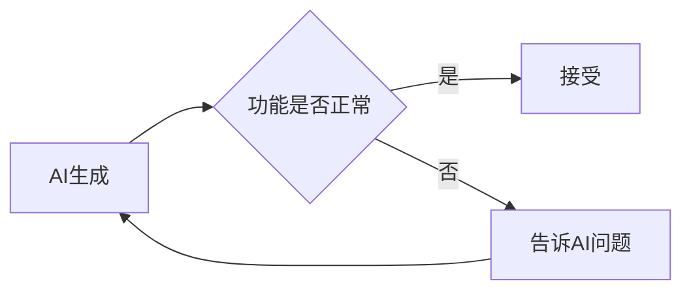
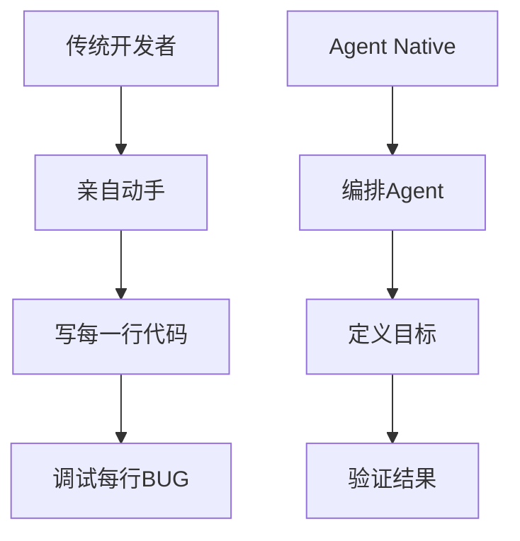
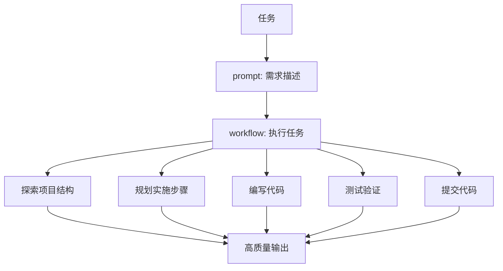

> **从"手写代码"向"自然语言编程"的跨越**

## 写在前面

在传统开发流程中，开发者 60% 的时间花费在语法细节、查找文档和编写样板代码上，只有 40% 用于核心业务逻辑。这种现状正在被一种全新的开发范式所改变——**VibeCoding**。

VibeCoding 不是简单的"AI 补全代码"，而是一种基于 **"自然语言提示词 + AI 实时生成 + 人工逻辑审查"** 的全新开发流。它的本质是让开发者从"搬砖工"升级为"代码架构师"和"验收官"。我们不再纠结于 if/else 的语法，而是专注于 **Vibe（感觉/逻辑/体验）** 是否对齐业务需求。

> 这个文档之前是作为团队分享用的，ai润色后放到博客上

## Agent Native：以 AI 为中心的开发思维

### 什么是 Agent Native

**Agent Native** = 以 AI Agent 为中心的开发思维

传统开发中，AI 是辅助工具（Copilot）；Agent Native 中，AI 是自主执行者（Autopilot）。

### 思维模式对比

| 维度     | "古法"开发                     | 传统AI辅助开发            | Agent Native 开发             |
| -------- | ------------------------------ | ------------------------- | ----------------------------- |
| 核心角色 | 代码的"搬运工"与"翻译官"       | 人写代码，AI 帮忙         | AI 为主，代码是 AI 的实现细节 |
| 工作方式 | 构思->手写代码->调试           | AI 是 Copilot             | AI 是 Autopilot               |
| 交互模式 | -                              | 人写 Prompt 指挥 AI       | AI 主动提问、规划、执行       |
| 输出形态 | 以函数、类、文件为单位逐步堆砌 | AI 生成代码片段，人来整合 | AI 自主完成完整任务           |
| 关注点   | 语法正确性，API 怎么调用       | 怎么写代码                | 写什么产品                    |

### Agent Native 的三大原则

#### 1. 意图驱动

告诉 AI 目标，让它自己决定实现方式：

```
❌ 传统思维：
"帮我写一个函数，接收数组参数，用 for 循环遍历，
遇到大于 10 的就 push 到新数组里..."

✅ Agent Native：
"过滤数组中大于 10 的元素，返回新数组"
```

#### 2. 异步协作

AI 可以在后台自动工作：

```
# 你设定目标，AI 自主执行
"实现用户评论功能，包括：
1. 数据库 schema（Comment 模型）
2. CRUD API
3. 前端评论表单
4. 评论列表展示

完成后告诉我，我先去忙别的。"
```

#### 3. 信任但验证

不要逐行检查 AI 的代码，而是：



**验证方式**：
- 功能测试：跑一下看看能不能用
- 类型检查：检查有没有报错
- 代码审查：只看关键逻辑，不看实现细节

### 从开发者到编排者

Agent Native 时代，需要进行角色转变：



| 传统开发者 | Agent Native 编排者 |
| :--------- | :------------------ |
| 手写代码   | 描述需求            |
| 逐个修复   | 反馈问题            |
| 关注语法   | 关注产品            |
| 是工匠     | 是指挥官            |

## 核心概念：Prompt + Workflow

### Vibecoding 的核心理念

```
Vibecoding = Prompt（提示词） + Workflow（工具流）
```

**Prompt 告诉 AI 做什么，Workflow 决定怎么做**



### 提示词的核心原则

AI 是一个强大的编程助手，它理解技术术语、熟悉各种框架、能快速分析代码。

**沟通的关键是：直接、具体、有上下文。**

#### 提示词对比：欠佳 vs 推荐

| 类型           | 欠佳                                                         | 推荐                                                         |
| :------------- | :----------------------------------------------------------- | :----------------------------------------------------------- |
| **角色扮演**   | "你是一位拥有 20 年经验的全栈工程师，精通 React、Vue、Angular、Node.js、Python..." | 直接说任务                                                   |
| **模糊指令**   | "帮我优化一下代码"                                           | "优化接口性能：添加多线程处理、延迟处理非核心逻辑"           |
| **无边界限制** | "写一个完整的电商系统"                                       | "实现用户评论功能，包括：评论表单、列表展示、数据持久化"     |
| **强行要求**   | "你必须给出正确答案，不能说不知道"                           | "如果不确定，请明确说'我不确定'，而不是编造答案"             |
| **具体任务**   | "帮我写一个登录功能"                                         | "实现用户登录功能：用户名+密码登录，使用 Node.js + MySQL，包含表单验证和错误处理" |
| **提供上下文** | "修复这个 Bug"                                               | "修复 Bug：文件 app/login/page.js，问题：用户登录后没有跳转到首页，预期：跳转到 /dashboard" |
| **指令要具体** | "添加测试"                                                   | "为 app/login/page.js 编写测试用例，框架：Playwright，覆盖场景：密码错误、账号不存在、网络错误" |

**核心原则**：
- 不要让 AI 猜 → 提供明确上下文
- 不要含糊其辞 → 给出具体要求
- 不要强行编造 → 给 AI 一个"不确定"的出口

#### 让 AI 反复提问

```markdown
"我要开发一个任务管理应用。
请反复问我问题，直到你完全理解我的需求。
不要猜测，直接问。"
```

#### 实用提示词模板

**代码生成模板**

```markdown
"实现 [功能名称]

技术栈：
- xx
- xx
- [其他技术]

需求：
1. [具体需求1]
2. [具体需求2]
3. [具体需求3]

注意事项：
- 遵循项目现有代码风格
- 不要引入新依赖，除非必要
- 包含错误处理"
```

**Bug 修复模板**

```markdown
"修复 Bug

文件路径: [完整路径]
错误信息:
[完整报错日志]

当前代码:
[相关代码片段]

期望行为: [描述]
实际行为: [描述]

请分析原因并提供修复方案"
```

## 标准工作流：五步法

### AI 的自动化能力

在开始工作流之前，记住：**AI 能自动处理很多任务**。

#### Claude Code vs 其他 AI 工具

**关键区别**：

| 特性           | Claude Code        | IDE（如Cursor/Windsurf） | 网页版（如ChatGPT） |
| :------------- | :----------------- | :----------------------- | :------------------ |
| **项目上下文** | ✅ 自动读取整个项目 | ✅ 自动读取               | ❌ 手动粘贴          |
| **命令执行**   | ✅ 直接运行 bash    | ✅ 集成终端               | ❌ 复制到终端        |
| **文件修改**   | ✅ 自动编辑多个文件 | ✅ 多文件编辑             | ⚠️ 逐个复制          |
| **版本控制**   | ✅ 自动提交         | ✅ Git 集成               | ❌ 手动操作          |
| **工作流**     | ✅ 标准化流程       | ⚠️ 需要手动               | ❌ 随意对话          |

**为什么 Claude Code 更适合 Vibecoding**：
1. CLI 原生：命令行是开发者的原生环境
2. 自动化程度高：减少手动操作
3. 标准化流程：探索 → 规划 → 实现 → 验证 → 提交
4. 完整上下文：理解整个项目结构

> **注意**：这里以 Claude Code 为例说明，在忽略 Claude Code 的特有 AI 能力的前提下，可以平替为 Gemini CLI、Codex、CodeBuddy CLI 等类似 CLI 工具。

#### AI 的自动化能力清单

**AI 能自动做的**：
- ✅ 自动探索项目结构（你不需要告诉它看哪些文件）
- ✅ 自动选择合适的工具（Read、Edit、Bash）
- ✅ 自动处理错误（失败会重试或换方案）
- ✅ 自动生成提交信息（根据修改内容）
- ✅ 自动识别依赖关系（知道修改会影响哪些文件）

**你需要做的**：
- 清楚描述任务目标
- 提供必要的上下文
- 验证结果并反馈

**不需要做**：
- ❌ 指定具体步骤（"先读文件A，再读文件B"）
- ❌ 告诉它用哪个工具（"用 Read 工具读取"）
- ❌ 手动组合命令（"运行 git add 然后 git commit"）
- ❌ 手动处理错误（"如果失败就重试"）

### 权限模式

#### 三种权限模式

| 模式             | 快捷键             | 特点                           | 适用场景           |
| :--------------- | :----------------- | :----------------------------- | :----------------- |
| **Default**      | Shift+Tab 循环切换 | 自动批准安全操作，询问危险操作 | 日常开发（推荐）   |
| **Plan**         | Shift+Tab          | 仅允许读取操作                 | 代码审查、探索     |
| **Accept Edits** | Shift+Tab          | 编辑操作需确认，其他自动       | 高度信任的编辑场景 |

### 五步工作流详解

**工作流是建议而非强制**

VibeCoding 五步工作流是一个**推荐的实践模式**，适合大多数开发场景。但你可以根据实际情况灵活调整：

- ✅ **推荐遵循**：复杂功能、不熟悉的项目、团队协作
- 🔄 **可以简化**：简单修改、熟悉的项目、个人开发
- ⚡ **可以跳过**：微小改动、明显的问题修复

**核心原则**：理解每步的目的后，根据实际情况灵活应用，而非机械执行。

#### 步骤 1：探索项目结构

**目的**：了解现有代码组织，避免重复工作

```
"探索这个项目的结构，告诉我:
1. 使用的技术栈
2. 文件组织方式
3. 现有的功能模块
4. 配置文件的作用"
```

#### 步骤 2：规划实现步骤

**目的**: 先想清楚再动手，减少返工

```
"我要添加用户评论功能。
请规划实现步骤，包括:
1. 需要创建哪些文件
2. 需要修改哪些现有文件
3. 数据库 schema 变更
4. 实现顺序"
```

#### 步骤 3：编写代码

**目的**：按计划实现功能

**AI 的自动拆分能力**：

复杂任务会被自动拆解：

```
# 你只需要输入
"实现用户评论功能"

# AI 会自动拆分为：
1. 更新 Prisma schema
2. 运行数据库迁移
3. 创建 API 端点
4. 编写前端组件
5. 集成到页面
6. 测试验证
```

> 当然你也可以一步步让它执行，告诉它你要让它做什么，例如"更新 Prisma schema"

#### 步骤 4：测试验证

**目的**：确保功能正常

```
"测试评论功能:
1. 验证 API 能正常创建评论
2. 验证评论能正确显示
3. 验证错误处理"
```

#### 步骤 5：提交代码

**目的**: 建立版本记录

```
"评论功能开发完成，提交代码"
```

## 理解 Agent

### 什么是 Agent

**Agent** = AI 本身

AI 本身就是一个 **Agent**，它的工作是：
- 理解你的意图和需求
- 做决策（用什么工具、先做什么后做什么）
- 协调各种工具完成任务

可以把 Agent 理解为一个**任务执行器**：
- 接收你的指令（提示词）
- 调用各种工具完成任务
- 返回执行结果

**与普通 AI 对话的区别**：

| 普通 AI 对话 | Agent      |
| :----------- | :--------- |
| 只能聊天     | 能调用工具 |
| 被动回答     | 主动决策   |
| 单轮交互     | 持续执行   |

### 自定义 Agent

**自定义 Agent** = 你创建的专门 Agent

自定义 Agent 是主 Agent 可以调用的"专门助手"。每个自定义 Agent：
- 有特定的用途和专业领域
- 有独立的上下文窗口（不污染主对话）
- 有自定义的系统提示（专门训练）
- 可以限制工具访问权限

**使用自定义 Agent 的优势**：

| 优势           | 说明                                          |
| :------------- | :-------------------------------------------- |
| **上下文保留** | 主对话保持简洁，自定义 Agent 独立处理复杂任务 |
| **专业分工**   | 针对特定任务优化（如代码审查、调试）          |
| **并行处理**   | 多个 Agent 可同时工作，提高效率               |
| **灵活权限**   | 可限制 Agent 只能用特定工具，提高安全性       |

**Agent 类型**：

| 类型           | 说明                      | 示例                     |
| :------------- | :------------------------ | :----------------------- |
| **官方内置**   | 系统自带，自动调用        | Plan（计划模式专用）     |
| **用户自定义** | 你创建的专门 Agent        | code-reviewer、debugger  |
| **通用 Agent** | Task 工具调用的通用 Agent | general-purpose、Explore |

> 关于如何创建自定义 Agent，以 Claude Code 为例，可以通过 `/agents` 命令进行创建和配置。具体可以参考 [Claude Code 官方文档](https://code.claude.com/docs/zh-CN/sub-agents)。

## 多 Agent 并行协作

### 什么是多 Agent 协作

Claude Code 会**自动启用多 Agent**来并行处理独立任务，每个 Agent 有独立的上下文窗口，专注完成特定工作。

**两种方式**：
1. **自动并行**：AI 识别到独立任务，自动创建通用 Agent 并行处理
2. **专门协作**：调用你创建的自定义 Agent（如 code-reviewer）

### 自动启用机制

Claude Code 根据任务描述**主动委派任务**，使用 **Task 工具**创建通用 Agent 并行处理：

触发条件：
- 任务描述中的关键词：**"并行"、"同时"、"多 Agent"**
- 自定义 Agent 配置中的 `description` 字段
- 当前上下文和可用工具

#### Task 工具

当 Claude Code 识别到独立任务时，会自动使用 **Task 工具**创建通用 Agent 来并行处理。

**通用 Agent vs 自定义 Agent**：

| 类型             | 调用方式           | 用途                             |
| :--------------- | :----------------- | :------------------------------- |
| **通用 Agent**   | Task 工具自动创建  | 通用任务（探索、搜索、读取文件） |
| **自定义 Agent** | `/agents` 命令创建 | 特定领域（代码审查、调试、测试） |

**特点**：
- 处理大量文件读取和搜索时更高效
- 多个通用 Agent 可以并行工作，加快速度
- 不需要预先配置，Claude 自动创建

### 并行能力说明

**Claude 的并行能力**：

在单个响应中，Claude 最多可以并行调用 **5-10 个独立工具/子代理**。

这意味着如果你有多个独立的任务（比如同时读取多个文件、执行多个独立的搜索等），Claude 可以在一条消息里一次性发出所有请求，大大提高效率。

#### 并行示例

**举例 1**：并行调研多个技术文档

```
任务：了解 Prisma、Drizzle、Supabase 三种数据持久化方案

串行方式：
读 Prisma 文档 → 等待 → 读 Drizzle 文档 → 等待 → 读 Supabase 文档 → 等待 → 总结对比

并行方式：
1 个消息 → 同时发起 3 个文档调研请求 → 收集所有信息 → 生成对比报告
```

**举例 2**：并行编写多个相关组件

```
任务：开发用户设置页面的多个功能模块

串行方式：
写头像上传 → 等待 → 写密码修改 → 等待 → 写通知偏好 → 等待 → 集成测试

并行方式：
1 个消息 → 同时启动 3 个 Agent 分别编写 3 个模块 → 收集所有代码 → 统一集成测试
```

**最佳实践**：
- 确保任务之间没有依赖关系
- 在提示词中使用"同时"、"并行"等关键词
- 让 Claude 自动识别哪些任务可以并行

### 使用示例

```
# 自动并行 - AI 自动识别独立任务
"同时做这三件事：
1. 编写后端 API（用户认证）
2. 编写前端 UI（登录表单）
3. 编写数据库 schema（User 表）"

# 明确使用多 Agent
"使用多 Agent 并行开发任务模块：
- 后端团队做 CRUD API
- 前端团队做任务列表和表单
- 数据库团队做 Task 模型"
```

### 进阶：并行会话与 Git Worktrees

**使用场景**：同时处理多个任务，完全隔离代码

**优势**：
- 每个工作目录完全隔离
- 更改不会相互影响
- 共享相同的 Git 历史

具体请参考 [Git Worktrees 模式](https://git-scm.com/docs/git-worktree)。

## 安全注意事项

### 敏感信息保护

**不要把敏感信息发送给 AI**：
- ❌ API 密钥、密码
- ❌ 生产数据库连接字符串
- ❌ 用户隐私数据

**不要让 AI 修改敏感配置文件**：
- 项目根目录的 .env
- SSH 密钥
- 生产环境配置

### 人在环路（Human-in-the-Loop）

AI 能够自主完成很多任务，但**建议依然保持人工审查**。在执行一些任务的过程中，AI 会通过一些语句来提示需要人工审查。

**AI 建议时保持警惕**：
- AI 说"可能破坏XXX"
- AI 建议删除大量代码
- AI 修改核心配置文件
- AI 建议重构核心模块

**操作建议**：
1. 要求 AI 解释改动原因
2. 检查受影响的文件列表
3. 考虑先在分支测试
4. 必要时寻求第二意见

## 写在最后

VibeCoding 代表了一种全新的开发范式，它不是要取代开发者，而是要让开发者从繁琐的代码编写中解放出来，专注于更有价值的架构设计和业务逻辑。

但需要明确的是：

> **"VibeCoding 不会让'菜鸟'直接变大神，它会让大神变'超人'。所以，我们依然要苦练内功，因为只有你站得够高，AI 才能带你飞得更远。"**

技术的进步不是为了让我们停止学习，而是让我们能够站在更高的层次上思考问题。掌握 VibeCoding，需要你对软件工程有深刻的理解，对业务需求有清晰的认知，对代码质量有严格的要求。

希望这篇文章能帮助你理解并实践 VibeCoding 工作流，在 AI 辅助开发的新时代中找到属于自己的节奏。

---

**相关资源**：
- [Claude Code 官方文档](https://code.claude.com/docs)
- [Git Worktrees 文档](https://git-scm.com/docs/git-worktree)